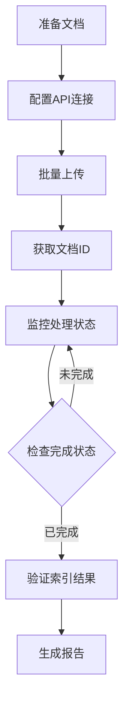

# 医疗文档上传工作流程指南

## 概述

本指南详细说明医疗文档上传到数据湖的完整工作流程，包括准备、上传、监控和验证等步骤。

## 工作流程图



## 详细步骤

### 步骤1：准备工作

#### 1.1 文档准备
- **文件格式**: 确保文档为支持格式（PDF、Word、Excel、TXT）
- **文件命名**: 使用有意义的文件名，便于识别
- **文件大小**: 单个文件不超过100MB
- **文件组织**: 按分类组织到不同文件夹

#### 1.2 分类规划
根据文档内容选择合适的分类：
- **临床指南**: 诊疗指南、临床路径
- **医学文献**: 学术论文、研究报告
- **药品说明书**: 药品使用说明
- **病历记录**: 患者病历
- **影像报告**: 检查报告
- **政策法规**: 医疗政策

### 步骤2：配置环境

#### 2.1 API配置
创建配置文件 `config.json`:
```json
{
  "api_base": "http://localhost:48200",
  "api_key": "your_api_key",
  "tenant_id": "default",
  "default_category": "医学文献"
}
```

#### 2.2 环境变量（可选）
```bash
export MEDICAL_API_KEY="your_api_key"
export MEDICAL_API_BASE="http://localhost:48200"
```

### 步骤3：批量上传

#### 3.1 使用Python脚本
```bash
# 基本用法
python batch_upload.py --folder /path/to/documents --category "临床指南"

# 带项目信息
python batch_upload.py --folder /path/to/documents \
  --category "药品说明书" \
  --project-id "P001" \
  --task-id "T001" \
  --priority "high"

# 使用配置文件
python batch_upload.py --folder /path/to/documents --config config.json
```

#### 3.2 使用Shell脚本
```bash
# 基本用法
./upload_folder.sh /path/to/documents

# 带参数
./upload_folder.sh -c "临床指南" --project P001 /path/to/documents
```

#### 3.3 上传选项说明
| 选项 | 说明 | 建议 |
|------|------|------|
| `--priority` | 处理优先级 | 紧急文档用`high`，普通文档用`normal` |
| `--parser` | 解析器选择 | 复杂PDF用`mineru2`，简单文档用`auto` |
| `--project-id` | 项目标识 | 用于跟踪和统计 |
| `--task-id` | 任务标识 | 用于关联业务逻辑 |

### 步骤4：监控状态

#### 4.1 自动监控
```bash
# 从上传报告加载文档ID
python monitor_status.py --report upload_report_20260127_103000.json

# 指定文档ID
python monitor_status.py --doc-ids DOC-001 DOC-002 DOC-003

# 自定义监控参数
python monitor_status.py --report report.json --interval 60 --duration 3600
```

#### 4.2 监控参数说明
| 参数 | 说明 | 默认值 |
|------|------|--------|
| `--interval` | 检查间隔（秒） | 30 |
| `--duration` | 监控总时长（秒） | 3600 |
| `--max-checks` | 最大检查次数 | 120 |

#### 4.3 状态解读
- **UPLOADED**: 文件已接收，等待处理
- **PARSING**: 正在解析文档内容
- **PARSED**: 解析完成，等待索引
- **INDEXING**: 正在建立搜索索引
- **COMPLETED**: 完全处理完成

### 步骤5：验证结果

#### 5.1 检查索引状态
```python
# 检查单个文档
status = check_document_status("DOC-001")
if status['storage']['es_indexed'] and status['storage']['iceberg_written']:
    print("✅ 文档已完全索引")
```

#### 5.2 验证搜索功能
```bash
# 使用API测试搜索
curl -X POST http://localhost:48200/api/v1/search/hybrid \
  -H "X-API-Key: your_key" \
  -d '{"query": "糖尿病", "top_k": 10}'
```

### 步骤6：生成报告

#### 6.1 上传报告
每次上传都会生成报告文件 `upload_report_YYYYMMDD_HHMMSS.json`，包含：
- 上传统计（成功/失败数量）
- 成功文档的ID和状态
- 失败文档的错误信息

#### 6.2 监控报告
监控完成后生成 `monitor_report_YYYYMMDD_HHMMSS.json`，包含：
- 文档处理状态汇总
- 各文档的最终状态
- 处理时间统计

## 高级工作流

### 增量上传
只上传新文件或修改过的文件：
```python
# 检查文件修改时间
if file.stat().st_mtime > last_upload_time:
    upload_file(file)
```

### 分类自动识别
根据文件名或内容自动分类：
```python
def auto_category(filename):
    if "指南" in filename:
        return "临床指南"
    elif "药品" in filename:
        return "药品说明书"
    else:
        return "医学文献"
```

### 质量控制
上传前进行质量检查：
1. **文件完整性**: 检查文件是否能正常打开
2. **内容验证**: 检查文档是否包含有效内容
3. **重复检查**: 避免重复上传相同文档

## 故障排除

### 常见问题

#### Q: 上传失败，错误401
A: API密钥无效或过期，检查配置文件中的`api_key`

#### Q: 上传成功但状态一直为UPLOADED
A: 解析服务可能有问题，检查解析器日志

#### Q: 文件上传很慢
A: 
1. 检查网络连接
2. 减少并发上传数量
3. 压缩大文件后再上传

#### Q: 文档解析失败
A:
1. 尝试使用不同的解析器（`--parser mineru2`）
2. 检查文档格式是否损坏
3. 将文档转换为PDF格式再上传

### 错误处理策略

#### 重试机制
```python
# 实现指数退避重试
for attempt in range(max_retries):
    try:
        upload_file(file)
        break
    except Exception as e:
        wait_time = base_delay * (2 ** attempt)
        time.sleep(wait_time)
```

#### 错误日志
- 记录详细的错误信息
- 保存失败文件列表
- 生成错误报告供后续分析

## 最佳实践

### 1. 分批处理
- 每批处理100-200个文件
- 批次间间隔30秒
- 监控每批的处理状态

### 2. 资源管理
- 控制并发上传数量（建议5-10个）
- 监控内存和CPU使用率
- 设置合理的超时时间

### 3. 数据安全
- 使用HTTPS传输敏感数据
- 定期轮换API密钥
- 记录所有操作日志

### 4. 性能优化
- 使用连接池复用HTTP连接
- 启用压缩减少传输数据量
- 缓存常用配置和结果

## 自动化脚本示例

### 完整的上传监控脚本
```python
#!/usr/bin/env python3
"""
自动化上传和监控脚本
"""

def automated_workflow(folder_path, category):
    # 1. 批量上传
    report = upload_folder(folder_path, category)
    
    # 2. 提取文档ID
    doc_ids = [item['doc_id'] for item in report['uploaded_files']]
    
    # 3. 监控状态
    monitor_report = monitor_documents(doc_ids)
    
    # 4. 验证结果
    if monitor_report['all_completed']:
        print("✅ 所有文档处理完成")
        # 5. 发送通知
        send_notification("上传完成", monitor_report)
    else:
        print("⚠️  部分文档未完成")
        # 记录未完成文档
        log_incomplete_documents(monitor_report)
    
    return monitor_report
```

## 相关工具

### 内置工具
1. **batch_upload.py**: 批量上传工具
2. **monitor_status.py**: 状态监控工具
3. **upload_folder.sh**: Shell包装脚本

### 外部工具集成
1. **文件监控**: 使用`inotifywait`监控文件夹变化
2. **任务调度**: 使用`cron`定时执行上传任务
3. **通知系统**: 集成Slack/Email发送处理状态

## 后续步骤

完成上传后，可以：
1. 使用搜索API检索文档内容
2. 分析文档统计信息
3. 建立文档知识图谱
4. 集成到业务系统中